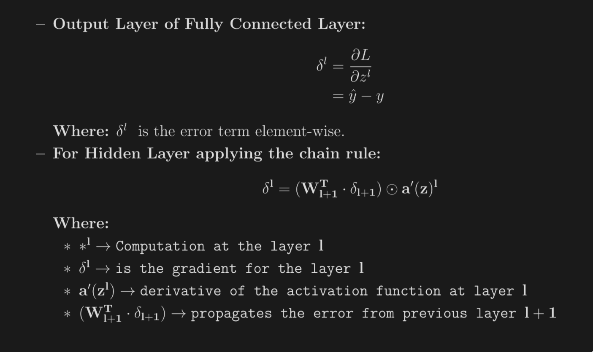

# CNN

CNN is a type of classifier, neural newtork used to identify patterns in data

## building blocks

- **tensor**  - n dimensional matrix, 3 dimension in CNN ? 
- **neuron** - function with multiple inputs and yielding single output (activation maps)
- **layer** - collection of neuron, same operation and hyprparameters
- **kernel weights and biases** - matrix for convolution 
- **differentiable score functions** - forms score maps

## layers

- **input** - input images with color channels
- **convolution** - learned kernels extract features
    - element wise dot product with kernel and output of previous layer
    - convolutional neuron is the result of all of the intermediate results summed together with the learned bias
    - size of kernel, stride is hyprparameter
    - input -> kernel -> element wise sum along with bias -> activation_map(output) 

    - **padding** 
        - convolutional operation discard few pixel which may accumulate to affect spatial integrity
        - convserve data at border, zero-padding also adopted by AlexNet,
        - No padding -(P > 0)no extra pixels added but padding adjusted using stride = 1, output = input
        - Valid Padding (no padding) - output feature map smaller after convolution

    - **kernel size** - filter size, appropriate size depends on size and dataset 
    - **stride** - step size, impact similar to kernel size 
    - **activation fn**  
        - max(0, x)ReLu - Rectified linear activation function
        - applies non-linearity (emperical observation: cnn using relu are faster)
        - avoids vanishing gradients.
        - **Dying Relu Problem**: large no. of neurons output zero for all inputs
        - sol: **Leaky Relu**- f (z) = max(α(z), z) : where α is hyperparameter and set to 0.01 usually
        - why not sigmoid (vanishing gradient)
        - As z → ∞, σ(z) approaches 1, leading to:
            - σ ′ (z) = σ(z) · (1 − σ(z)) ⇒ 1 · (1 − 1) = 0
            - z → -∞, σ ′ (z) = σ(z) · (1 − σ(z)) ⇒ 0 · (1 − 0) =

    - **softmax**
        - CNN outputs sums to 1
        - outputs to probabilities
        - logit - unscaled scalar value
        - even standard normalization scales logits to 0 and 1 so ?  
        - softmax - approximating "argmax" while ganing differentiability
- **pooling**
    - decreasing the spatial extent of newtork 
    - different types of pooling
    - max pooling - create a kernel and stride size perform convolution and pick max element

- **flatten**
    - converts 3 dims to 1 dim to input in FCNN
    - softmax requires 1 dim input ? 

- 

## Backward pass
- in backward pass we perform, 
- Computing the Gradient w.r.t the filter F:
    convolution between input X and the gradient of the error δ = ∂O
- Computing the gradient w.r.t the input X:
    convolution between flipped filter F and the gradient of the error
    ∂E
    δ = ∂O

## Keras Class

```python
# class used to create convolutional newtork
layer = Conv2D(filters, kernel_size, strides=(1,1), padding="valid", activation=None, use_bias=True,
kernel_initializer="glorot_uniform")

# each neuron computes
Y = activation(W ∗ X + b)

# syntax of pooling layers
from tensorflow.keras.layers import MaxPooling2D, AveragePooling2D

max_pool = MaxPooling2D(pool_size=(2,2), strides=None, padding="valid")
avg_pool = AveragePooling2D(pool_size=(2,2), strides=None, padding="valid")

# CNN 
# prepares model for training with optimizer loss function and metrices
model.compile(optimizer=’SGD’, loss=’sparse_categorical_crossentropy’, metrics=[’accuracy’])

# trains model by iterating through traning data, each batch has forward and backward propagation both 
model.fit(train_ds, epochs=10, validation_data=val_ds)
```


