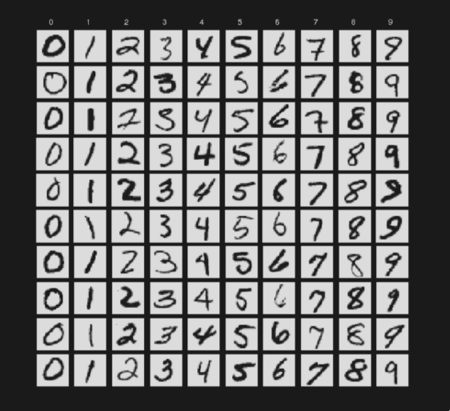

# ERM Framework

## Soft max regression on MNIST dataset

- 60,000 training examples and 10,000 test
- 28 X 28 pixels, 0-255

### Soft max

- sigmoid function for multivariate inputs
- properties: boundness, sum-to-one, smoothness, monotonicity
  - monotonic = If 𝑧𝑖 increases, then its probability 𝜎 (𝑧𝑖) also increases.

- for numerical stability - we do (z - np.max(z))
- get the z through the linear equation `X @ W + b`, pass it to softmax, get the max class `np.argmax`

- `Logits` are the raw, unnormalized scores
- `Categorical Cross-Entropy Loss` is a generalized form of log loss 
    - concept comes from `Maximum Likelihood Estimation (MLE)`
